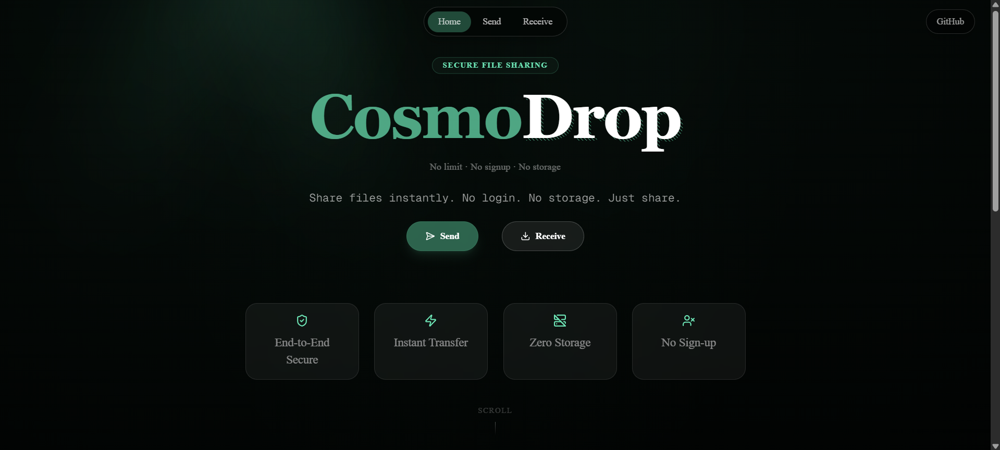

# ShareFy



ShareFy is a real-time peer-to-peer file sharing web app. Create a room, share the 5-digit code with anyone in the world, and transfer files instantly through the browser — no sign-up required.

---

## Tech Stack

| Layer | Technology |
|---|---|
| Framework | Next.js 15 (App Router) |
| Language | TypeScript |
| Styling | Tailwind CSS v4 |
| Animations | Motion (Framer Motion) |
| Real-time | Socket.io Client |
| Components | shadcn/ui + Radix UI |
| Icons | Lucide React |

---

## Project Structure

```
my-app/
├── app/
│   ├── api/route.ts        # Room creation API
│   ├── Send/page.tsx       # Send file page
│   ├── Receive/page.tsx    # Receive file page
│   ├── layout.tsx          # Root layout
│   └── page.tsx            # Home page
├── components/
│   └── ui/                 # Reusable UI components
├── lib/
│   └── use-socket.ts       # Socket.io client hook
├── public/                 # Static assets
└── .env.local              # Environment variables
```

---

## How to Use

1. Open the app and click **Send Files**
2. Click **Create Room** — a 5-digit room code is generated
3. Share the code with the recipient
4. Recipient opens the app, goes to **Receive Files**, and enters the code
5. Upload a file — transfer starts instantly

---

## Getting Started

### 1. Install dependencies

```bash
npm install
```

### 2. Set environment variable

In `.env.local`:

```env
NEXT_PUBLIC_SOCKET_URL=https://your-socket-server.up.railway.app
```

### 3. Run the app

```bash
npm run dev
```

Then open [http://localhost:3000](http://localhost:3000)

---

## NPM Commands

| Command | Description |
|---|---|
| `npm run dev` | Start Next.js dev server |
| `npm run build` | Build for production |
| `npm run start` | Start production server |
| `npm run lint` | Run ESLint |
